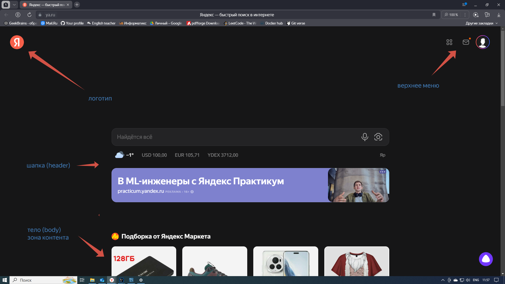
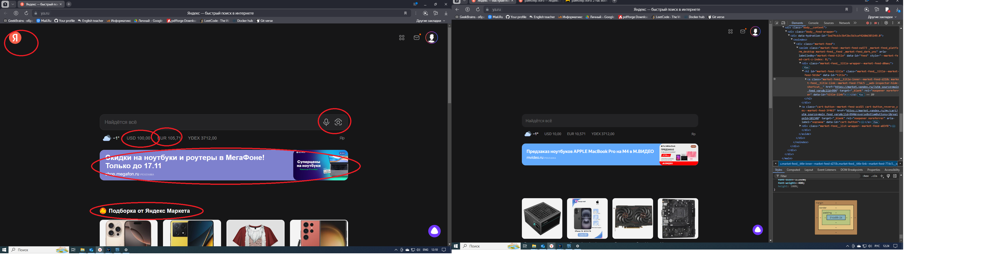
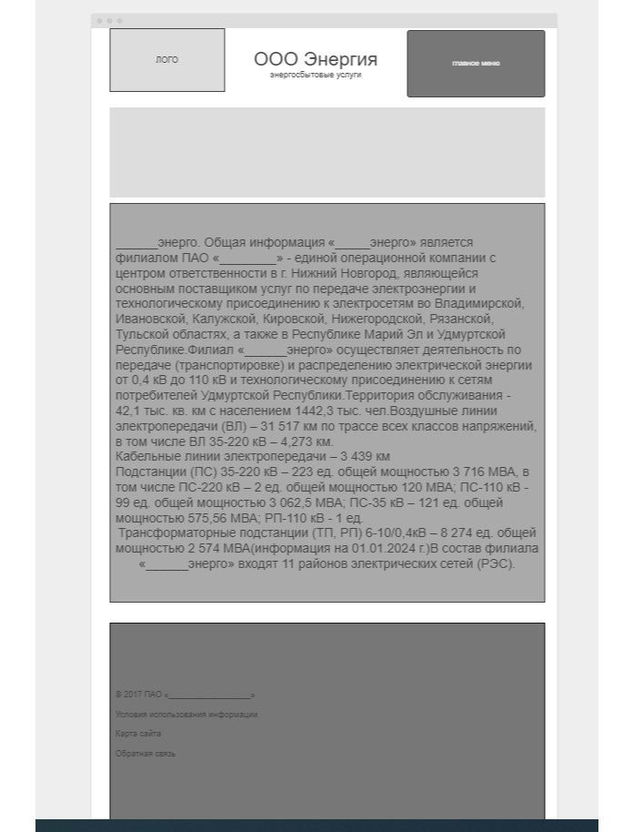

# Урок 2. Семинар. Веб-технологии: вчера, сегодня, завтра
## На основе сайта ```yandex.ru```:

1. Определите, на каком протоколе работает сайт.
   ``https://ya.ru/`` - пртокол ``HTTPS``

2. Проанализируйте структуру страницы сайта

   

3. Внесите не менее 10 изменений на страницу с помощью инструмента разработчика и представьте скриншоты было/стало.

   


4. Создайте прототип низкой детализации.

   

